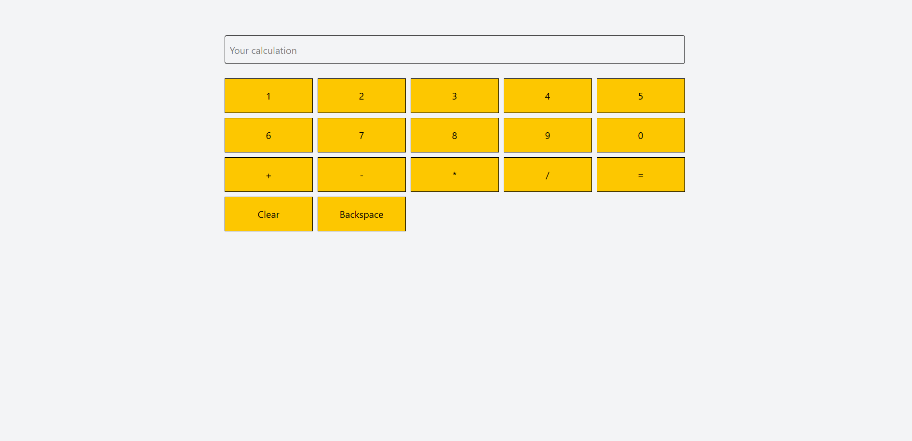

# 🧮 React Calculator

A simple and interactive calculator application built using **React.js**.  
This project allows users to perform basic arithmetic operations with a clean and responsive UI.

---

## 🚀 Features

- ➕ Addition
- ➖ Subtraction
- ✖ Multiplication
- ➗ Division
- 🧹 Clear all input
- ⬅ Backspace support
- ⚠ Error handling for invalid expressions
- 📱 Responsive layout

---

## 🛠 Tech Stack

- React.js
- JavaScript (ES6)
- HTML5
- CSS3
- Tailwind CSS

---

## 📸 Screenshot



---

## 📂 Project Structure

```text
calculator_react/
├── src/
│   ├── components/
│   │   ├── inputField.jsx
│   │   ├── buttons.jsx
│   │   └── buttonItem.jsx
│   ├── App.jsx
│   ├── main.jsx
│   └── index.css
├── screenshots/
│   └── calculator.png
├── package.json
└── README.md
